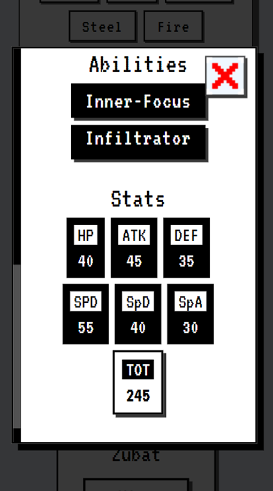
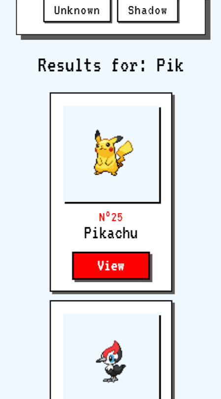

# PokeDex

## Sobre o projeto

O projeto em questão se trata de uma PokeDex, desenvolvida de forma autoral com a biblioteca React.Js e consumindo dados da PokeAPI. Este projeto foi desenvolvido com o objetivo de demonstrar e praticar minhas habiliades como desenvolvedor Front-End e com a biblioteca React.js.

É possível acessar a página a partir do botão a seguir.

## Layout Mobile

## Layout Desktop

## Tecnologias utilizadas

### Front-End

### Ferramentas Externas

◾ ScrollRevealjs.org

◾️ vincentgarreau.com/particles.js

◾️ FormSubmit.co

## Autor

◾️ Maicon de Oliveira da Silva

